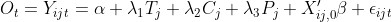
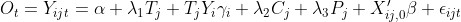
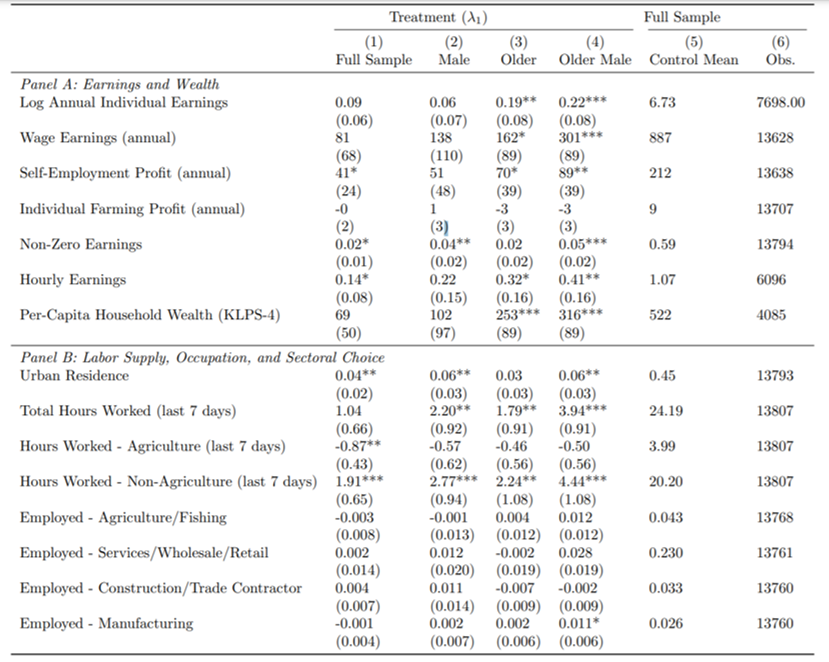

# Reproduction Attempt for "Twenty Year Economic Impacts of Deworming"

### Overview

The is a reproduction attempt for "Twenty Year Economic Impacts of Deworming" by [Hamory et al. (2021)](https://www.pnas.org/content/118/14/e2023185118). The effort followed the [Guide for Accelerating Computational Reproducibility](https://bitss.github.io/ACRE/) (ACRE) from the [Berkeley Initiative for Transparency in the Social Sciences](https://www.bitss.org/) (BITSS). The reproduction attempt is logged [here](https://www.socialsciencereproduction.org/reproductions/4043c95e-0a6a-4acc-b228-4c4abe10b3c4/index) on the [Social Science Reproduction Platform](https://www.socialsciencereproduction.org/) (SSRP). 

The attempt follows the provided [reproduction package](https://dataverse.harvard.edu/dataset.xhtml?persistentId=doi:10.7910/DVN/TTYMHI), which includes an [appendix](https://www.pnas.org/highwire/filestream/980209/field_highwire_adjunct_files/0/pnas.2023185118.sapp.pdf).

### Description

Hamory et al. expand the deworming literature by assessing impacts 20 years in the future. Data from the Primary School Deworming Project (PSDP), a randomized intervention conducted across control and treatment schools, is cross-referenced with the Kenya Life Panel Survey (KLPS) to assess a variety of living standards. Regression is conducted on two sets of KLPS data with the following specification:



where *Y* is an outcome for an individual *i* in school *j* in survey round *t*, *T* indicates treatment, *C* and *P* are cost-sharing and saturation indicators, and *X* denotes a panel of school and individual covariates.

Kenyan school children who received deworming interventions.

The treatment group experienced:

1. 305 USD PPP more consumption.

2. 80 USD PPP greater individual earnings.

3. 239 USD PPP greater household earnings.

4. 0.14 USD PPP greater hourly earnings.

5. 0.04% greater likelihood to live in urban areas

6. 1.91 more nonagricultural weekly work hours.

The social IRR is 37% and the 25 year, 10% discount rate NPV is USD PPP 230.71.

### Package

Installations of [R](https://cran.r-project.org/mirrors.html) and [Stata **IC**](https://www.stata.com/install-guide/) are required to run the analysis and cleaning scripts.

The following is a diagram of all inputs and outputs, where "manual" indicates a manual transcription:

```
  Table 1 - KLPS4_E+_earnings_consumption_main_byage.tex
  └── Earnings_consumption_hhearn_main_byage.do
      ├── Worms20_master_main.do
      │   └── Worms20_MasterDo.do
      │       └── Worms20_Globals.do
      └── Worms20_Analysis.dta
  Table 2 - KLPS4_E+_earnings_labor_occchoice_main_byage.tex
  └── Earnings_wealth_labor_occchoice_main_byage.do
      ├── Worms20_master_main.do
      │   └── Worms20_MasterDo.do
      │       └── Worms20_Globals.do
      └── Worms20_Analysis.dta
  Figure 1 - KLPS4_KD_fullsample.eps
  └── Consumption_earnings_KD.do
      ├── Worms20_master_main.do
      │   └── Worms20_MasterDo.do
      │       └── Worms20_Globals.do
      └── Worms20_Analysis.dta
  Figure 2 - KLPS4_cost_benefit_pooled.eps
  └── Cost_benefit_pooled.R
      └── Table S12
          └── Cost_benefit_table_pooled.Rmd
              └── Parameters
  In-Text Result - percent_ever_surveyed.log
  └── Worms20_intext_calc.do
      ├── Worms20_Attrition.dta
      └── Worms20_Heterogeneity.dta
  In-Text Result - percent_currently_in_school.log
  └── Worms20_intext_calc.do
      ├── Worms20_Attrition.dta
      └── Worms20_Heterogeneity.dta
  In-Text Result - agriculture_with_hhmembers.log
  └── Worms20_intext_calc.do
      ├── Worms20_Attrition.dta
      └── Worms20_Heterogeneity.dta
  In-Text Result - FDRadjustment_olderyounger.log
  └── Worms20_intext_calc.do
      ├── Worms20_Attrition.dta
      └── Worms20_Heterogeneity.dta
  In-Text Result - percent_urban_nairobi.log
  └── Worms20_intext_calc.do
      ├── Worms20_Attrition.dta
      └── Worms20_Heterogeneity.dta
  In-Text Result - lambda1_lambda2_coefficients.log
  └── Worms20_intext_calc.do
      ├── Worms20_Attrition.dta
      └── Worms20_Heterogeneity.dta
  In-Text Result - saturation_4km.log
  └── Worms20_intext_calc.do
      ├── Worms20_Attrition.dta
      └── Worms20_Heterogeneity.dta
  Figure S1
  └── manual
      └── input placeholder 1
  Figure S2
  └── manual
      └── Confidential location data
  Figure S3A - KLPS4_consumption_graph.eps
  └── Consumption_graph.R
      └── Consumption_results_for_R.xlsx
          └── Consumption_gender_results_for_R.do
              ├── Worms20_Analysis.dta
              └── Worms20_master_paper_appendix.do
  Figure S3B - KLPS4_earnings_graph.eps
  └── Earnings_graph.R
      └── Earnings_results_for_R.xlsx
          └── Earnings_gender_results_for_R.do
              ├── Worms20_Analysis.dta
              └── Worms20_master_paper_appendix.do
  Figure S4 - ConsumptionTreatEffect_YearsTreat.eps
  └── Consumption_yearstreat_figure.do
      ├── Worms20_Analysis.dta
      └── Worms20_master_paper_appendix.do
  Table S1 - KLPS4_E+_Attrition_main.tex
  └── Attrition_main.do
      ├── Worms20_Attrition.dta
      └── Worms20_master_paper_appendix.do
  Table S2 - KLPS4_E+_Attrition_olderyounger.tex
  └── Attrition_byage.do
      ├── Worms20_Attrition.dta
      └── Worms20_master_paper_appendix.do
  Table S3 - KLPS4_E+_earnings_consumption_main_byage_klps4.tex
  └── Earnings_consumption_hhearn_main_byage_klps4.do
      ├── Worms20_Analysis.dta
      └── Worms20_master_paper_appendix.do
  Table S4 - KLPS4_E+_earnings_labor_occchoice_main_byage_klps4.tex
  └── Earnings_wealth_labor_occchoice_main_byage_klps4.do
      ├── Worms20_Analysis.dta
      └── Worms20_master_paper_appendix.do
  Table S5 - KLPS4_E+_earnings_consumption_main_byage_scyvoced.tex
  └── Earnings_consumption_hhearn_main_byage_scyvoced.do
      ├── Worms20_Analysis.dta
      ├── Worms20_Analysis_scyvoced.dta
      └── Worms20_master_paper_appendix.do
  Table S6 - KLPS4_E+_earnings_labor_occchoice_main_byage_scyvoced.tex
  └── Earnings_wealth_labor_occchoice_main_byage_scyvoced.do
      ├── Worms20_Analysis.dta
      ├── Worms20_Analysis_scyvoced.dta
      └── Worms20_master_paper_appendix.do
  Table S7 - KLPS4_E+_pooled_outcomes_extended.tex
  └── Three_panel_main_outcomes.do
      ├── Worms20_Analysis.dta
      └── Worms20_master_paper_appendix.do
  Table S8 - KLPS4_E+_pooled_earnings_consumption_parentsedu_long.tex
  └── Earnings_consump_parentsedu_long.do
      ├── Worms20_Heterogeneity.dta
      └── Worms20_master_paper_appendix.do
  Table S9 - KLPS4_E+_pooled_earnings_consumption_5yr_agebuckets_long.tex
  └── Threepanel_earn_consump_5yr_agebuckets_long.do
      ├── Worms20_Analysis.dta
      └── Worms20_master_paper_appendix.do
  Table S10 - KLPS4_E+_heterogeneity_summarystats.tex
  └── Heterogeneity_summarystats.do
      ├── Worms20_Heterogeneity.dta
      └── Worms20_master_paper_appendix.do
  Table S11 - KLPS4_E+_heterogeneity_treateffects.tex
  └── Heterogeneity_treateffects.do
      ├── Worms20_Heterogeneity.dta
      ├── Worm_Infection_Panel.dta
      └── Worms20_master_paper_appendix.do
  Table S12
  └── Cost_benefit_table_pooled.Rmd
      └── Parameters
```

Edits to the original file include:

- Master R script that removes the need for manually setting the directory, removes repetitive library calls, and compiles `Cost_benefit_pooled.R`, `Consumption_graph.R`, `Earnings_graph.R`, and `Cost_benefit_table_pooled.Rmd`.

- Swap "Figure 1" and "Figure 2" in `Worms20_master_main.do`.

- Added missing package `texdoc` on line 33 of Worms20_MasterDo.do.

- Removed

  `set mem ___
  set matsize ___
  set maxvar ___`

  from each file for compatibility with Stata **IC**.

- Added LaTeX template with `\bettershortstack` and `\sym` macros.

### Robustness

A robustness check is conducted on results 4 through 6 (and, indirectly, result 2). A regression is conducted on only male *and* older subjects to isolate the confluence of the two variables. We adopt the following regression specification



where Y includes an individual's gender, age, and an interaction variable between gender and age.

The results, with the additional specification in column 4, are below:



Considering only older males increases the significance of every effect over male or older subjects alone. We observe particularly large increases in effect size for wage earnings (301 vs. 162), non-zero earnings (0.05 vs 0.02), total hours worked (3.94 vs 2.2), and non-agriculture hours worked (4.44 vs. 2.77). These results suggest that the overall increase may be driven in large part by older males specifically.


